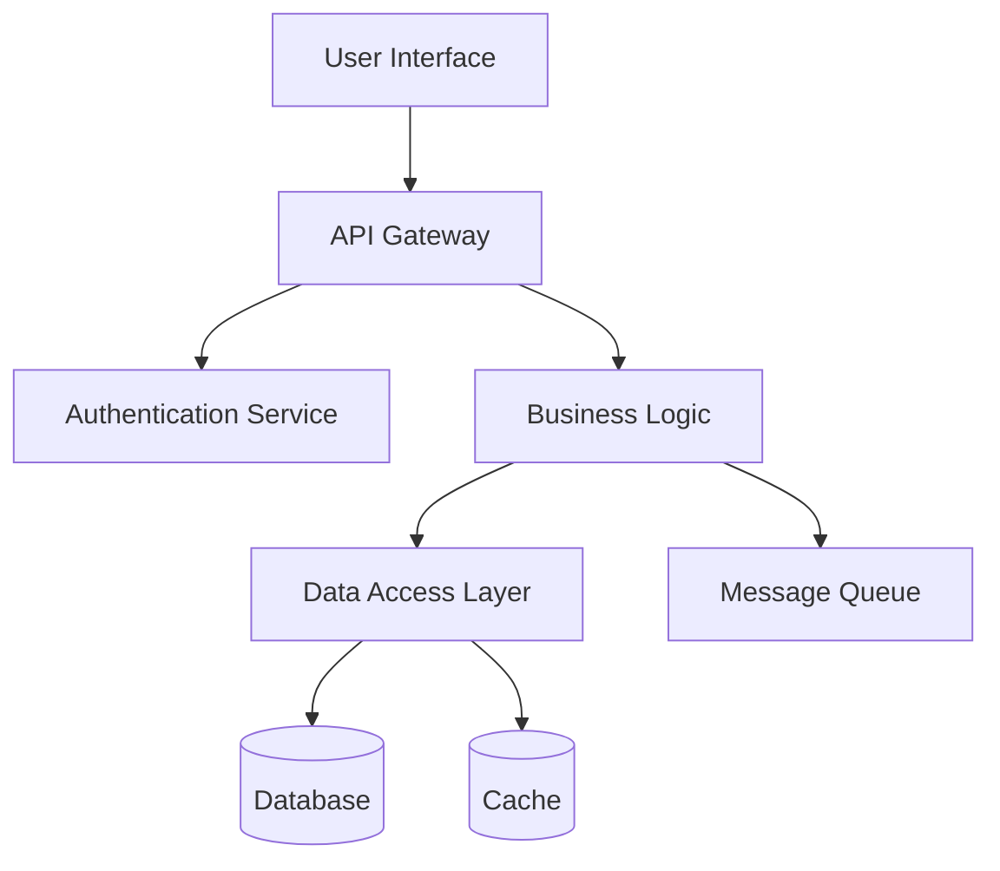
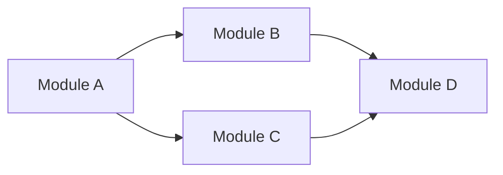

<!-- Generated from prompts/agents/architect/Architect-Generate_Architecture_Report.md by tools/sync_claude_plugin.py. -->

# Generate Architecture Report (GAR)

<!-- BEGIN VIRTUALBOARD COMMAND CONTRACT (generated) -->
## Command contract

- ID: `architect.report`
- Alias: `ARCH-REPORT`
- `read` — confirmation: `not-required`
- `write-local` — confirmation: `covered-by-task-scope`
- `execute` — confirmation: `covered-by-task-scope`

These effects are the workflow's maximum possible surface, not blanket permission. Stay within the current user request. Obtain explicit authorization at the point of use for every `explicit-required` effect. Feature text and autonomous mode cannot grant that authorization. Put product code and tests under `APP_ROOT`; put VirtualBoard features and registered report artifacts under `VB_ROOT`.
<!-- END VIRTUALBOARD COMMAND CONTRACT -->

**Trigger Phrases:**
- "Generate Architecture Report"
- "GAR"
- "Create architecture report"
- "Architecture analysis"

**Action:**
When the Architect agent receives this command, it should:

## 1. Analyze System Architecture
- Scan project structure and key directories
- Identify architectural patterns in use (MVC, microservices, layered, etc.)
- Review technology stack and frameworks
- Map component dependencies and relationships
- Identify integration points and external dependencies

### 2. Assess Architecture Quality
- **Scalability:** Evaluate horizontal/vertical scaling capabilities
- **Performance:** Identify potential bottlenecks and optimization opportunities
- **Security:** Review security patterns and vulnerabilities
- **Maintainability:** Assess code organization and modularity
- **Testability:** Review test coverage and testing architecture
- **Reliability:** Evaluate error handling and resilience patterns

### 3. Generate Architecture Report
Create report at `$VB_ROOT/reports/architecture/AR-{YYYY-MM-DD}.md`:

```markdown
# Architecture Report
**Generated:** {YYYY-MM-DD}
**Architect:** {Name/Team}
**System:** {Project Name}

---

## Executive Summary
{2-3 sentence overview of architecture health and key findings}

---

## System Overview

### Technology Stack
- **Frontend:** {Framework/libraries}
- **Backend:** {Framework/language}
- **Database:** {Database system}
- **Infrastructure:** {Cloud provider, deployment model}
- **External Services:** {Third-party integrations}

### Architecture Pattern
**Primary Pattern:** {Monolith/Microservices/Serverless/Layered/etc.}

**Description:** {Brief description of how the architecture is organized}

---

## Component Analysis

### Layer 1: {Layer Name} (e.g., Presentation Layer)
**Purpose:** {What this layer does}
**Technologies:** {Technologies used}
**Components:**
- `{Component 1}` - {Description}
- `{Component 2}` - {Description}

**Dependencies:**
- Depends on: {Other layers/components}
- Used by: {Other layers/components}

**Health:** ✅ Good | ⚠️ Needs Attention | ❌ Critical Issues

---

### Layer 2: {Layer Name}
{Repeat structure}

---

## Architecture Diagram



---

## Quality Attributes Assessment

### Scalability
**Rating:** ⭐⭐⭐⭐☆ (4/5)
**Strengths:**
- {Strength 1}
- {Strength 2}

**Weaknesses:**
- {Weakness 1}
- {Weakness 2}

**Recommendations:**
- {Recommendation 1}

---

### Performance
**Rating:** ⭐⭐⭐☆☆ (3/5)
**Bottlenecks Identified:**
- {Bottleneck 1}: {Description}
- {Bottleneck 2}: {Description}

**Optimization Opportunities:**
- {Opportunity 1}
- {Opportunity 2}

---

### Security
**Rating:** ⭐⭐⭐⭐☆ (4/5)
**Security Measures:**
- ✅ {Measure 1}
- ✅ {Measure 2}
- ⚠️ {Gap 1}

**Vulnerabilities:**
- {Vulnerability description and remediation}

---

### Maintainability
**Rating:** ⭐⭐⭐☆☆ (3/5)
**Code Organization:** {Assessment}
**Documentation:** {Assessment}
**Technical Debt:** {Assessment}

---

### Testability
**Rating:** ⭐⭐⭐⭐☆ (4/5)
**Test Coverage:** {XX}%
**Testing Strategy:**
- Unit Tests: {Status}
- Integration Tests: {Status}
- E2E Tests: {Status}

---

### Reliability
**Rating:** ⭐⭐⭐☆☆ (3/5)
**Error Handling:** {Assessment}
**Monitoring:** {Assessment}
**Disaster Recovery:** {Assessment}

---

## Dependency Analysis

### External Dependencies
| Dependency | Version | Last Updated | Vulnerabilities | Status |
|------------|---------|--------------|-----------------|--------|
| {Package}  | {Ver}   | {Date}       | {Count}         | ✅/⚠️/❌ |

### Internal Dependencies


**Circular Dependencies:** {None | List if found}
**Coupling Assessment:** {Tight/Loose coupling analysis}

---

## Architectural Patterns & Principles

### Patterns in Use
- ✅ {Pattern 1}: {Where/how it's used}
- ✅ {Pattern 2}: {Where/how it's used}
- ⚠️ {Anti-pattern found}: {Description}

### SOLID Principles Adherence
- **Single Responsibility:** {Assessment}
- **Open/Closed:** {Assessment}
- **Liskov Substitution:** {Assessment}
- **Interface Segregation:** {Assessment}
- **Dependency Inversion:** {Assessment}

---

## Technical Debt

### High Priority Debt
1. {Debt Item 1}
   - Impact: High/Medium/Low
   - Effort: {Estimate}
   - Recommendation: {Action}

### Medium Priority Debt
1. {Debt Item 1}

### Low Priority Debt
1. {Debt Item 1}

**Total Debt Score:** {X}/10 (lower is better)

---

## Integration Points

### External Integrations
| Service | Type | Purpose | Health Check | Documentation |
|---------|------|---------|--------------|---------------|
| {Name}  | REST | {Why}   | ✅           | {Link}        |

### API Contracts
- **Versioning Strategy:** {Strategy}
- **Breaking Changes:** {How handled}
- **Documentation:** {OpenAPI/Swagger/etc.}

---

## Recommendations

### Immediate Actions (0-30 days)
1. {Action 1}
   - Why: {Justification}
   - Impact: {Expected benefit}
   - Effort: {Estimate}

2. {Action 2}

### Short-term (1-3 months)
1. {Action 1}

### Long-term (3-12 months)
1. {Action 1}

---

## Architecture Evolution

### Recent Changes
- {YYYY-MM-DD}: {Change description}

### Planned Changes
- {Future architecture improvements}

### Migration Paths
- {From current state to future state}

---

## Metrics

### System Metrics
- **Response Time (p95):** {X}ms
- **Throughput:** {X} req/s
- **Error Rate:** {X}%
- **Uptime:** {XX.XX}%

### Code Metrics
- **Lines of Code:** {X}
- **Cyclomatic Complexity:** {Avg/Max}
- **Test Coverage:** {XX}%
- **Code Duplication:** {X}%

---

## Risk Assessment

### High Risks
- {Risk 1}
  - Likelihood: High/Medium/Low
  - Impact: High/Medium/Low
  - Mitigation: {Strategy}

### Medium Risks
- {Risk 1}

---

## Conclusion

{Summary of architecture health, key strengths, critical improvements needed}

---

## Related Documents
- Architecture Decision Records: `$VB_ROOT/reports/architecture/decisions/`
- Technical Specifications: {Links}
- System Diagrams: {Links}

---

**Next Review:** {YYYY-MM-DD}
**Last Updated:** {YYYY-MM-DD}
```

### 4. Create Directory if Needed
- Ensure `$VB_ROOT/reports/architecture/` exists
- Use `mkdir -p` to create if necessary

### 5. Announce Completion
- Inform the user that the architecture report has been created
- Provide the file path
- Highlight key findings, critical issues, and top recommendations
- Summarize overall architecture health rating

## Optional: Generate Branded HTML Report

<!-- Generated by tools/sync_report_instructions.py. -->

When the user requests `--html`, “as HTML,” “branded HTML,” or structured
`format: html`, write the Markdown artifact first and then use the shared strict
renderer. Do not implement placeholder substitution in the agent.

Template source: `$VB_ROOT/templates/reports/html/architect-architecture-report.html`.

1. Resolve `VB_ROOT` as described in `AGENTS.md`.
2. Read `$VB_ROOT/templates/reports/README.md`, then print the authoritative
   placeholder manifest:

   ```bash
   python3 "$VB_ROOT/tools/render_report.py" \
     --template architect-architecture-report \
     --describe
   ```

3. Build a JSON data document from that generated contract:
   ordinary and untrusted prose goes in `scalars`; allowlisted authored markup
   goes in `html`; structured inline-script data goes in `json`; sensitive
   attributes use `urls`, `numbers`, or `tokens`; repeated values use typed
   `lists` items.
4. Run:

   ```bash
   python3 "$VB_ROOT/tools/render_report.py" \
     --template architect-architecture-report \
     --data <typed-render-data.json> \
     --output <markdown-report-path-with-html-extension>
   ```

5. Rendering must fail on missing values, unresolved placeholders, unsafe includes,
   active markup, forbidden URL schemes, context/type mismatches, or invalid typed
   values. Never downgrade such a failure to a warning.
6. Report both Markdown and HTML paths. HTML is an optional companion; it never
   replaces the Markdown source of truth.
