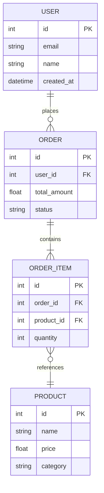

# Data Engineer Commands

This file defines specialized commands and actions for the Data Engineer agent role.

## ⚠️ IMPORTANT: Command Display Requirement

**When you adopt the Data Engineer agent role and load this command file, you MUST immediately display a summary of available commands to the user.**

**Format:**
```
📋 Available Data Engineer Commands:
• GDP (Generate Data Pipeline) - Create ETL/ELT pipeline with transformations
• GMD (Generate Metrics Dashboard) - Build analytics dashboard with key metrics
• GDQ (Generate Data Quality Check) - Create data validation and quality rules
• ERD (Entity Relationship Diagram) - Create data model diagram for database schemas and service models
```

This ensures users know what commands are available to them.

---

## Generate Data Pipeline (GDP)

**Trigger Phrases:**
- "Generate Data Pipeline"
- "GDP"
- "Create data pipeline"
- "Build ETL pipeline"
- "Create data flow"

**Action:**
When the Data Engineer agent receives this command, it should:

### 1. Define Pipeline Scope
- Data source(s) and destination(s)
- Transformation requirements
- Schedule/trigger (batch, real-time, event-driven)
- Data volume and performance requirements
- Dependencies on other pipelines

### 2. Create Pipeline Structure

**Example Structure (Python/Airflow):**
```
src/pipelines/{pipeline_name}/
├── dag_{pipeline_name}.py           # Airflow DAG definition
├── extractors/
│   └── {source}_extractor.py        # Data extraction logic
├── transformers/
│   └── {name}_transformer.py        # Data transformation logic
├── loaders/
│   └── {destination}_loader.py      # Data loading logic
├── schemas/
│   └── {entity}_schema.py           # Data schemas/models
└── tests/
    └── test_{pipeline_name}.py      # Pipeline tests
```

**DAG Template:**
```python
from airflow import DAG
from airflow.operators.python import PythonOperator
from datetime import datetime, timedelta

default_args = {
    'owner': 'data-team',
    'depends_on_past': False,
    'retries': 3,
    'retry_delay': timedelta(minutes=5),
}

with DAG(
    '{pipeline_name}',
    default_args=default_args,
    description='{Pipeline description}',
    schedule_interval='@daily',  # or cron expression
    start_date=datetime(2025, 1, 1),
    catchup=False,
    tags=['data-pipeline', '{domain}'],
) as dag:

    extract_task = PythonOperator(
        task_id='extract_data',
        python_callable=extract_data,
    )

    transform_task = PythonOperator(
        task_id='transform_data',
        python_callable=transform_data,
    )

    load_task = PythonOperator(
        task_id='load_data',
        python_callable=load_data,
    )

    quality_check_task = PythonOperator(
        task_id='quality_check',
        python_callable=run_quality_checks,
    )

    extract_task >> transform_task >> load_task >> quality_check_task
```

### 3. Add Data Quality Checks
```python
def run_quality_checks(data):
    checks = [
        ('row_count', lambda df: len(df) > 0),
        ('null_check', lambda df: df['critical_field'].notna().all()),
        ('value_range', lambda df: df['amount'].between(0, 1000000).all()),
        ('schema_check', lambda df: set(df.columns) == expected_columns),
    ]

    for check_name, check_func in checks:
        assert check_func(data), f"Quality check failed: {check_name}"
```

### 4. Create Documentation
Create docs at `.virtualboard/data/pipelines/{pipeline_name}.md`:

```markdown
# Pipeline: {Name}

## Overview
{Description of what this pipeline does}

## Data Flow
```
{Source} → [Extract] → [Transform] → [Load] → {Destination}
```

## Schedule
- **Frequency:** {daily/hourly/real-time}
- **Trigger:** {time/event}

## Data Sources
- **{Source 1}:** {Description}
- **{Source 2}:** {Description}

## Transformations
1. {Transformation description}
2. {Transformation description}

## Data Destinations
- **{Destination}:** {Description}

## Quality Checks
- Row count validation
- Null value checks
- Data type validation
- Business rule validation

## Dependencies
- Upstream: {Pipeline dependencies}
- Downstream: {Pipelines that depend on this}

## Monitoring
- **Alerts:** {Alert conditions}
- **Dashboard:** {Link to monitoring dashboard}
- **SLA:** {Expected completion time}

---

**Owner:** Data Engineering Team
**Last Updated:** {YYYY-MM-DD}
```

### 5. Announce Completion
- List files created
- Show DAG visualization
- Provide testing instructions

---

## Generate Metrics Dashboard (GMD)

**Trigger Phrases:**
- "Generate Metrics Dashboard"
- "GMD"
- "Create dashboard"
- "Build analytics dashboard"

**Action:**
[To be defined - coming soon]

---

## Generate Data Quality Check (GDQ)

**Trigger Phrases:**
- "Generate Data Quality Check"
- "GDQ"
- "Create data validation"
- "Quality rules"

**Action:**
[To be defined - coming soon]

---

## Entity Relationship Diagram (ERD)

**Trigger Phrases:**
- "Entity Relationship Diagram"
- "ERD"
- "Create data model diagram"
- "Generate ERD"
- "Create database diagram"
- "Show data model"

**Action:**
When the Data Engineer agent receives this command, it should:

### 1. Analyze Project Data Models
- Scan database schemas (SQL files, migrations, ORM models)
- Identify service models (API endpoints, service layer)
- Extract UI data structures (component props, state management)
- Map relationships between entities
- Document primary keys, foreign keys, and constraints
- Identify data domains and bounded contexts

### 2. Create Mermaid ERD Diagram

**ERD Template Structure:**
```markdown
# Entity Relationship Diagram

## Overview
{Description of the data model and its scope}

## Database Schemas
{Mermaid ERD diagram for database entities}

## Service Models
{Mermaid ERD diagram for service layer entities}

## UI Data Structures
{Mermaid ERD diagram for UI state and props}

## Relationships Summary
{Text description of key relationships}

## Key Entities

### {Entity Name}
- **Type:** {Database/Service/UI}
- **Description:** {Entity purpose}
- **Key Fields:**
  - `field_name` (type): Description
  - `field_name` (type): Description

## Data Flow
{High-level data flow description}

---

**Generated:** {YYYY-MM-DD}
**Scope:** {Database/Services/UI}
**Owner:** Data Engineering Team
```

**Mermaid ERD Syntax Example:**
````markdown

````

### 3. Document Relationships
- Identify one-to-one, one-to-many, many-to-many relationships
- Document cardinality and constraints
- Note any circular dependencies or design issues
- Suggest optimizations for query performance

### 4. Generate Report

**File Location:** `.virtualboard/reports/{YYYY-MM-DD}_Entity_Relationship_Diagram.md`

**Report Sections:**
1. **Overview** - High-level description of the data model
2. **Database Schemas** - ERD for database entities (Mermaid diagram)
3. **Service Models** - ERD for service layer models (Mermaid diagram)
4. **UI Data Structures** - ERD for UI state and components (Mermaid diagram)
5. **Entity Catalog** - Detailed list of all entities with fields
6. **Relationship Map** - Text description of all relationships
7. **Data Flow** - High-level flow diagram
8. **Recommendations** - Suggestions for improvements

### 5. Best Practices for ERD Creation

**Database ERD:**
- Include all tables and columns
- Show primary keys (PK) and foreign keys (FK)
- Use appropriate cardinality symbols (||, }o, o|)
- Group related entities by domain
- Include indexes and constraints notes

**Service Model ERD:**
- Map API request/response models
- Show service boundaries
- Document data transformations between services
- Include shared/common models

**UI Data ERD:**
- Show component prop structures
- Map state management (Redux, Context, etc.)
- Document form data structures
- Include UI-specific computed fields

### 6. Announce Completion
- List all entities discovered and documented
- Show key relationships identified
- Provide recommendations for data model improvements
- Include link to the generated diagram file

---

## Command Execution Guidelines

When executing Data Engineer commands:
- **Confirm the command** - State which command you're executing
- **Be thorough** - Validate data quality and pipeline integrity
- **Be accurate** - Verify actual data flows and transformations
- **Be actionable** - Provide specific pipeline improvements
- **Follow standards** - Maintain data governance and quality standards

---

**Last Updated:** 2025-10-09
**Role:** Data Engineer
