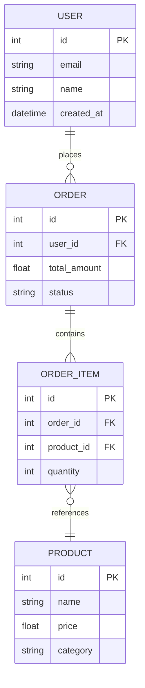

# Entity Relationship Diagram (ERD)

**Trigger Phrases:**
- "Entity Relationship Diagram"
- "ERD"
- "Create data model diagram"
- "Generate ERD"
- "Create database diagram"
- "Show data model"

**Action:**
When the Data Engineer agent receives this command, it should:

## 1. Analyze Project Data Models
- Scan database schemas (SQL files, migrations, ORM models)
- Identify service models (API endpoints, service layer)
- Extract UI data structures (component props, state management)
- Map relationships between entities
- Document primary keys, foreign keys, and constraints
- Identify data domains and bounded contexts

### 2. Create Mermaid ERD Diagram

**ERD Template Structure:**
```markdown
# Entity Relationship Diagram

## Overview
{Description of the data model and its scope}

## Database Schemas
{Mermaid ERD diagram for database entities}

## Service Models
{Mermaid ERD diagram for service layer entities}

## UI Data Structures
{Mermaid ERD diagram for UI state and props}

## Relationships Summary
{Text description of key relationships}

## Key Entities

### {Entity Name}
- **Type:** {Database/Service/UI}
- **Description:** {Entity purpose}
- **Key Fields:**
  - `field_name` (type): Description
  - `field_name` (type): Description

## Data Flow
{High-level data flow description}

---

**Generated:** {YYYY-MM-DD}
**Scope:** {Database/Services/UI}
**Owner:** Data Engineering Team
```

**Mermaid ERD Syntax Example:**
````markdown

```mermaid
erDiagram
    USER ||--o{ ORDER : places
    USER {
        int id PK
        string email
        string name
        datetime created_at
    }
    ORDER ||--|{ ORDER_ITEM : contains
    ORDER {
        int id PK
        int user_id FK
        float total_amount
        string status
    }
    ORDER_ITEM }o--|| PRODUCT : references
    ORDER_ITEM {
        int id PK
        int order_id FK
        int product_id FK
        int quantity
    }
    PRODUCT {
        int id PK
        string name
        float price
        string category
    }
```
````

### 3. Document Relationships
- Identify one-to-one, one-to-many, many-to-many relationships
- Document cardinality and constraints
- Note any circular dependencies or design issues
- Suggest optimizations for query performance

### 4. Generate Report

**File Location:** `.virtualboard/reports/{YYYY-MM-DD}_Entity_Relationship_Diagram.md`

**Report Sections:**
1. **Overview** - High-level description of the data model
2. **Database Schemas** - ERD for database entities (Mermaid diagram)
3. **Service Models** - ERD for service layer models (Mermaid diagram)
4. **UI Data Structures** - ERD for UI state and components (Mermaid diagram)
5. **Entity Catalog** - Detailed list of all entities with fields
6. **Relationship Map** - Text description of all relationships
7. **Data Flow** - High-level flow diagram
8. **Recommendations** - Suggestions for improvements

### 5. Best Practices for ERD Creation

**Database ERD:**
- Include all tables and columns
- Show primary keys (PK) and foreign keys (FK)
- Use appropriate cardinality symbols (||, }o, o|)
- Group related entities by domain
- Include indexes and constraints notes

**Service Model ERD:**
- Map API request/response models
- Show service boundaries
- Document data transformations between services
- Include shared/common models

**UI Data ERD:**
- Show component prop structures
- Map state management (Redux, Context, etc.)
- Document form data structures
- Include UI-specific computed fields

### 6. Announce Completion
- List all entities discovered and documented
- Show key relationships identified
- Provide recommendations for data model improvements
- Include link to the generated diagram file

---

## Optional: Generate Branded HTML Report

If the user appends `--html`, says "as HTML"/"branded HTML", or sets
`format: html`, also produce an HTML rendering. **Additive** — the Markdown
report is always written first.

1. Load `templates/reports/html/data-erd.html`. The comment block at the top of
   that file lists every placeholder this command must compute, with the same
   names used in the Markdown report.
2. Inline `{INCLUDE: _partials/<name>.html}` directives by reading and
   pasting the referenced files; iterate until no `{INCLUDE:` markers remain.
3. Substitute `{BRAND_LOGO_DATAURI}` with the contents of
   `templates/reports/html/_partials/astucia-logo.b64.txt`, **stripping leading
   and trailing whitespace** (the file may end in a newline that must not
   appear inside `src="…"`).
4. Substitute `{BRAND_NAME}` (default `Astucia`) and `{BRAND_TAGLINE}`
   (default `AI Development Studio`) unless the user provided overrides.
5. Substitute the cross-cutting placeholders (`REPORT_TITLE`,
   `REPORT_TITLE_HTML`, `REPORT_SUBTITLE`, `EYEBROW`, `GENERATED_DATE`,
   `GENERATED_DATETIME`, `AUTHOR_AGENT`, `CLASSIFICATION`, `PROJECT_NAME`,
   `NAV_LINKS`, `FOOTER_PRIMARY_LINE`, `FOOTER_SECONDARY_LINE`,
   `FOOTER_NOTE_BLOCK`, `EXTRA_SCRIPTS`).
6. Substitute the per-template scalar placeholders:
   `DOMAIN`, `EXECUTIVE_SUMMARY_HTML`, `DIAGRAM_HTML`, `KPI_ENTITIES`, `KPI_RELATIONSHIPS`, `KPI_PRIMARY_KEYS`, `KPI_FOREIGN_KEYS`, `NORMALIZATION_HTML`, `INDEXING_HTML`, `NEXT_REVIEW_DATE`.
7. Expand each `{#NAME}…{/NAME}` list block once per item using the
   per-template list placeholders: `HERO_META_CELLS`, `ENTITIES`, `RELATIONSHIPS`, `INDEXES`. The per-item field names are
   documented in the template's top comment.
8. For each list, set the matching `LIST_EMPTY_<NAME>` scalar to `""` if the
   list has items, or to a small italic note (e.g.
   `<p class="empty-note">No items.</p>`) if the list is empty.
9. Write the rendered HTML next to the Markdown:
   `.virtualboard/reports/{YYYY-MM-DD}_Entity_Relationship_Diagram.html`.
10. **Verify before reporting completion.** Search the rendered output for any
    literal `{` — there must be none. Resolve leftovers (or substitute the
    empty string for known-optional slots) before continuing.
11. In your final reply, list **both** file paths.

A filled-in reference example lives at
`templates/reports/examples/data-erd.example.html`.
