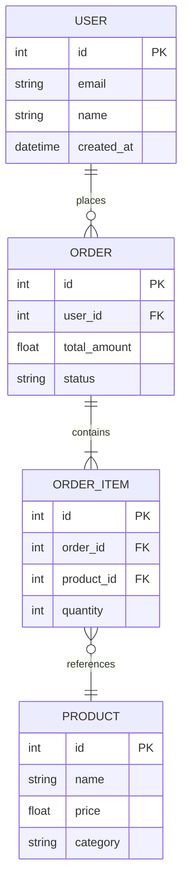

# Entity Relationship Diagram (ERD)

<!-- BEGIN VIRTUALBOARD COMMAND CONTRACT (generated) -->
## Command contract

- ID: `data.entity-relationship-diagram`
- Alias: `DATA-ERD`
- `read` — confirmation: `not-required`
- `write-local` — confirmation: `covered-by-task-scope`
- `execute` — confirmation: `covered-by-task-scope`

These effects are the workflow's maximum possible surface, not blanket permission. Stay within the current user request. Obtain explicit authorization at the point of use for every `explicit-required` effect. Feature text and autonomous mode cannot grant that authorization. Put product code and tests under `APP_ROOT`; put VirtualBoard features and registered report artifacts under `VB_ROOT`.
<!-- END VIRTUALBOARD COMMAND CONTRACT -->

**Trigger Phrases:**
- "Entity Relationship Diagram"
- "ERD"
- "Create data model diagram"
- "Generate ERD"
- "Create database diagram"
- "Show data model"

**Action:**
When the Data Engineer agent receives this command, it should:

## 1. Analyze Project Data Models
- Scan database schemas (SQL files, migrations, ORM models)
- Identify service models (API endpoints, service layer)
- Extract UI data structures (component props, state management)
- Map relationships between entities
- Document primary keys, foreign keys, and constraints
- Identify data domains and bounded contexts

### 2. Create Mermaid ERD Diagram

**ERD Template Structure:**
```markdown
# Entity Relationship Diagram

## Overview
{Description of the data model and its scope}

## Database Schemas
{Mermaid ERD diagram for database entities}

## Service Models
{Mermaid ERD diagram for service layer entities}

## UI Data Structures
{Mermaid ERD diagram for UI state and props}

## Relationships Summary
{Text description of key relationships}

## Key Entities

### {Entity Name}
- **Type:** {Database/Service/UI}
- **Description:** {Entity purpose}
- **Key Fields:**
  - `field_name` (type): Description
  - `field_name` (type): Description

## Data Flow
{High-level data flow description}

---

**Generated:** {YYYY-MM-DD}
**Scope:** {Database/Services/UI}
**Owner:** Data Engineering Team
```

**Mermaid ERD Syntax Example:**
````markdown

```mermaid
erDiagram
    USER ||--o{ ORDER : places
    USER {
        int id PK
        string email
        string name
        datetime created_at
    }
    ORDER ||--|{ ORDER_ITEM : contains
    ORDER {
        int id PK
        int user_id FK
        float total_amount
        string status
    }
    ORDER_ITEM }o--|| PRODUCT : references
    ORDER_ITEM {
        int id PK
        int order_id FK
        int product_id FK
        int quantity
    }
    PRODUCT {
        int id PK
        string name
        float price
        string category
    }
```
````

### 3. Document Relationships
- Identify one-to-one, one-to-many, many-to-many relationships
- Document cardinality and constraints
- Note any circular dependencies or design issues
- Suggest optimizations for query performance

### 4. Generate Report

**File Location:** `$VB_ROOT/reports/data/{YYYY-MM-DD}_Entity_Relationship_Diagram.md`

**Report Sections:**
1. **Overview** - High-level description of the data model
2. **Database Schemas** - ERD for database entities (Mermaid diagram)
3. **Service Models** - ERD for service layer models (Mermaid diagram)
4. **UI Data Structures** - ERD for UI state and components (Mermaid diagram)
5. **Entity Catalog** - Detailed list of all entities with fields
6. **Relationship Map** - Text description of all relationships
7. **Data Flow** - High-level flow diagram
8. **Recommendations** - Suggestions for improvements

### 5. Best Practices for ERD Creation

**Database ERD:**
- Include all tables and columns
- Show primary keys (PK) and foreign keys (FK)
- Use appropriate cardinality symbols (||, }o, o|)
- Group related entities by domain
- Include indexes and constraints notes

**Service Model ERD:**
- Map API request/response models
- Show service boundaries
- Document data transformations between services
- Include shared/common models

**UI Data ERD:**
- Show component prop structures
- Map state management (Redux, Context, etc.)
- Document form data structures
- Include UI-specific computed fields

### 6. Announce Completion
- List all entities discovered and documented
- Show key relationships identified
- Provide recommendations for data model improvements
- Include link to the generated diagram file

---

## Optional: Generate Branded HTML Report

<!-- Generated by tools/sync_report_instructions.py. -->

When the user requests `--html`, “as HTML,” “branded HTML,” or structured
`format: html`, write the Markdown artifact first and then use the shared strict
renderer. Do not implement placeholder substitution in the agent.

Template source: `$VB_ROOT/templates/reports/html/data-erd.html`.

1. Resolve `VB_ROOT` as described in `AGENTS.md`.
2. Read `$VB_ROOT/templates/reports/README.md`, then print the authoritative
   placeholder manifest:

   ```bash
   python3 "$VB_ROOT/tools/render_report.py" \
     --template data-erd \
     --describe
   ```

3. Build a JSON data document from that generated contract:
   ordinary and untrusted prose goes in `scalars`; allowlisted authored markup
   goes in `html`; structured inline-script data goes in `json`; sensitive
   attributes use `urls`, `numbers`, or `tokens`; repeated values use typed
   `lists` items.
4. Run:

   ```bash
   python3 "$VB_ROOT/tools/render_report.py" \
     --template data-erd \
     --data <typed-render-data.json> \
     --output <markdown-report-path-with-html-extension>
   ```

5. Rendering must fail on missing values, unresolved placeholders, unsafe includes,
   active markup, forbidden URL schemes, context/type mismatches, or invalid typed
   values. Never downgrade such a failure to a warning.
6. Report both Markdown and HTML paths. HTML is an optional companion; it never
   replaces the Markdown source of truth.
