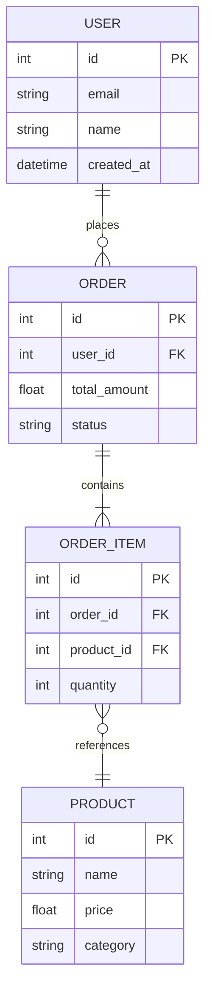

# Entity Relationship Diagram (ERD)

**Trigger Phrases:**
- "Entity Relationship Diagram"
- "ERD"
- "Create data model diagram"
- "Generate ERD"
- "Create database diagram"
- "Show data model"

**Action:**
When the Data Engineer agent receives this command, it should:

## 1. Analyze Project Data Models
- Scan database schemas (SQL files, migrations, ORM models)
- Identify service models (API endpoints, service layer)
- Extract UI data structures (component props, state management)
- Map relationships between entities
- Document primary keys, foreign keys, and constraints
- Identify data domains and bounded contexts

### 2. Create Mermaid ERD Diagram

**ERD Template Structure:**
```markdown
# Entity Relationship Diagram

## Overview
{Description of the data model and its scope}

## Database Schemas
{Mermaid ERD diagram for database entities}

## Service Models
{Mermaid ERD diagram for service layer entities}

## UI Data Structures
{Mermaid ERD diagram for UI state and props}

## Relationships Summary
{Text description of key relationships}

## Key Entities

### {Entity Name}
- **Type:** {Database/Service/UI}
- **Description:** {Entity purpose}
- **Key Fields:**
  - `field_name` (type): Description
  - `field_name` (type): Description

## Data Flow
{High-level data flow description}

---

**Generated:** {YYYY-MM-DD}
**Scope:** {Database/Services/UI}
**Owner:** Data Engineering Team
```

**Mermaid ERD Syntax Example:**
````markdown

````

### 3. Document Relationships
- Identify one-to-one, one-to-many, many-to-many relationships
- Document cardinality and constraints
- Note any circular dependencies or design issues
- Suggest optimizations for query performance

### 4. Generate Report

**File Location:** `.virtualboard/reports/{YYYY-MM-DD}_Entity_Relationship_Diagram.md`

**Report Sections:**
1. **Overview** - High-level description of the data model
2. **Database Schemas** - ERD for database entities (Mermaid diagram)
3. **Service Models** - ERD for service layer models (Mermaid diagram)
4. **UI Data Structures** - ERD for UI state and components (Mermaid diagram)
5. **Entity Catalog** - Detailed list of all entities with fields
6. **Relationship Map** - Text description of all relationships
7. **Data Flow** - High-level flow diagram
8. **Recommendations** - Suggestions for improvements

### 5. Best Practices for ERD Creation

**Database ERD:**
- Include all tables and columns
- Show primary keys (PK) and foreign keys (FK)
- Use appropriate cardinality symbols (||, }o, o|)
- Group related entities by domain
- Include indexes and constraints notes

**Service Model ERD:**
- Map API request/response models
- Show service boundaries
- Document data transformations between services
- Include shared/common models

**UI Data ERD:**
- Show component prop structures
- Map state management (Redux, Context, etc.)
- Document form data structures
- Include UI-specific computed fields

### 6. Announce Completion
- List all entities discovered and documented
- Show key relationships identified
- Provide recommendations for data model improvements
- Include link to the generated diagram file
