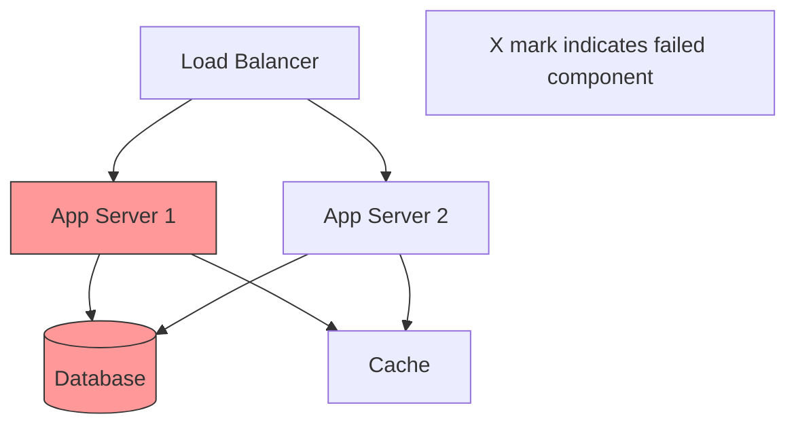

# Generate Incident Report (GIR)

**Trigger Phrases:**
- "Generate Incident Report"
- "GIR"
- "Create incident report"
- "Document incident"
- "Post-mortem"

**Action:**
When the DevOps agent receives this command, it should:

## 1. Gather Incident Information
- Incident ID and severity level
- Time of detection and resolution
- Affected services and users
- Impact scope and business consequences
- Key personnel involved

### 2. Construct Timeline
- Collect logs and monitoring data
- Identify key events and decision points
- Document actions taken
- Note communication timestamps
- Track escalations and resolutions

### 3. Perform Root Cause Analysis
- Identify immediate cause
- Trace contributing factors
- Review system weaknesses
- Examine process gaps
- Consider human factors

### 4. Create Incident Report
- Create report at `.virtualboard/incidents/reports/IR-{YYYY-MM-DD}-{incident-id}.md`
- Use the following structure:

```markdown
# Incident Report
**Incident ID:** {INC-####}
**Date:** {YYYY-MM-DD}
**Severity:** Critical | High | Medium | Low
**Status:** Resolved | Investigating | Monitoring
**Prepared By:** {Agent/Person}

---

## Executive Summary

**What Happened:**
{Brief 2-3 sentence description of the incident}

**Impact:**
- **Duration:** {Start time} - {End time} ({X} hours {Y} minutes)
- **Users Affected:** {Number/Percentage}
- **Services Impacted:** {List of services}
- **Business Impact:** {Revenue/SLA/Customer impact}

**Root Cause:**
{One sentence summary of root cause}

**Resolution:**
{One sentence summary of how it was resolved}

---

## Incident Details

### Detection
- **Detected At:** {YYYY-MM-DD HH:MM UTC}
- **Detected By:** {Person/System/Alert}
- **Detection Method:** {Monitoring alert/User report/etc}
- **Initial Alert:**
  ```
  {Alert message or initial report}
  ```

### Classification
- **Severity:** Critical | High | Medium | Low
- **Category:** {Infrastructure/Application/Database/Network/Security}
- **Affected Components:**
  - {Component 1}
  - {Component 2}
  - {Component 3}

### Scope of Impact
- **Services Down:** {List}
- **Services Degraded:** {List}
- **Geographic Impact:** {Regions affected}
- **User Impact:** {Number and type of users}
- **Data Impact:** {Any data loss/corruption}

---

## Timeline of Events

All times in UTC.

### {YYYY-MM-DD HH:MM} - Initial Detection
- Alert fired: {alert name}
- Symptoms observed: {symptoms}
- On-call engineer paged: {name}

### {HH:MM} - Investigation Begins
- Checked {system/logs}
- Identified potential cause: {initial hypothesis}
- Escalated to {team/person}

### {HH:MM} - Root Cause Identified
- Found: {specific issue}
- Evidence: {logs/metrics showing the issue}
- Decision made: {action to take}

### {HH:MM} - Mitigation Started
- Action taken: {specific action}
- Command executed:
  ```bash
  {command if applicable}
  ```
- Result: {immediate outcome}

### {HH:MM} - Service Recovering
- Metrics returning to normal
- Error rate decreased from {X}% to {Y}%
- Response time improved to {Z}ms

### {HH:MM} - Incident Resolved
- All systems operational
- Monitoring confirmed stability
- Post-incident tasks identified

### {HH:MM} - All-Clear Declared
- {X} hour monitoring period completed
- No recurrence observed
- Stakeholders notified

---

## Root Cause Analysis

### The Five Whys

1. **Why did the incident occur?**
   - {Answer}

2. **Why did that happen?**
   - {Answer}

3. **Why did that condition exist?**
   - {Answer}

4. **Why wasn't it prevented?**
   - {Answer}

5. **Why was the system vulnerable?**
   - {Answer - this is typically the root cause}

### Root Cause
{Detailed explanation of the underlying root cause}

### Contributing Factors
1. {Factor 1}
   - Description: {Details}
   - Impact: {How it contributed}

2. {Factor 2}
   - Description: {Details}
   - Impact: {How it contributed}

### What Went Well
- {Positive aspect 1}
- {Positive aspect 2}
- {Positive aspect 3}

### What Went Wrong
- {Problem 1}
- {Problem 2}
- {Problem 3}

---

## Technical Details

### System State at Incident

**Infrastructure:**
```yaml
service: {service-name}
environment: {production/staging}
version: {version-number}
replicas: {count}
cpu_usage: {X}%
memory_usage: {Y}%
disk_usage: {Z}%
```

**Relevant Configuration:**
```yaml
# Configuration that was relevant to the incident
{relevant config}
```

### Logs and Evidence

**Error Logs:**
```
{Relevant error logs}
```

**Metrics at Time of Incident:**
- Error Rate: {X}% (normal: {Y}%)
- Response Time: {X}ms p95 (normal: {Y}ms)
- Traffic: {X} req/s (normal: {Y} req/s)
- Database Connections: {X} (max: {Y})

**Monitoring Dashboard:**
{URL to relevant dashboard or screenshot description}

### Architecture Diagram



---

## Resolution

### Immediate Actions Taken
1. {Action 1}
   - Executed by: {person}
   - Time: {HH:MM}
   - Result: {outcome}
   - Command:
     ```bash
     {command if applicable}
     ```

2. {Action 2}
   - Executed by: {person}
   - Time: {HH:MM}
   - Result: {outcome}

### Verification Steps
```bash
# Steps taken to verify resolution
{verification commands}
```

**Results:**
- [ ] Error rate returned to normal
- [ ] Response times within SLA
- [ ] All health checks passing
- [ ] No errors in logs
- [ ] User reports positive

---

## Impact Assessment

### Quantitative Impact
- **Total Downtime:** {X} hours {Y} minutes
- **Users Affected:** {count} ({percentage}% of total)
- **Failed Requests:** {count}
- **Data Loss:** {amount/none}
- **SLA Breach:** Yes/No - {details if yes}

### Business Impact
- **Revenue Impact:** ${amount} (estimated)
- **Customer Impact:** {description}
- **Reputation Impact:** {description}
- **Support Tickets:** {count} tickets created
- **Refunds/Credits:** ${amount}

### Customer Communication
- **Status Page Updates:** {count} updates
- **Support Emails Sent:** {count}
- **Social Media Posts:** {count}
- **Customer Calls:** {count}

---

## Action Items

### Immediate (This Week)
- [ ] **{Action Item 1}** - Owner: {person} - Due: {date}
  - Description: {what needs to be done}
  - Priority: Critical/High/Medium

- [ ] **{Action Item 2}** - Owner: {person} - Due: {date}
  - Description: {what needs to be done}
  - Priority: Critical/High/Medium

### Short-term (This Month)
- [ ] **{Action Item 3}** - Owner: {person} - Due: {date}
  - Description: {what needs to be done}
  - Priority: High/Medium

- [ ] **{Action Item 4}** - Owner: {person} - Due: {date}
  - Description: {what needs to be done}
  - Priority: Medium

### Long-term (This Quarter)
- [ ] **{Action Item 5}** - Owner: {team} - Due: {date}
  - Description: {what needs to be done}
  - Priority: Medium/Low

---

## Prevention Measures

### Technical Improvements
1. {Improvement 1}
   - What: {description}
   - Why: {justification}
   - Effort: {time estimate}
   - Impact: {expected improvement}

2. {Improvement 2}
   - What: {description}
   - Why: {justification}
   - Effort: {time estimate}
   - Impact: {expected improvement}

### Process Improvements
1. {Process Change 1}
   - Current: {current process}
   - Proposed: {new process}
   - Benefit: {what this prevents}

2. {Process Change 2}
   - Current: {current process}
   - Proposed: {new process}
   - Benefit: {what this prevents}

### Monitoring Improvements
```yaml
# New alerts to be created
alerts:
  - name: {alert-name}
    condition: {when to trigger}
    threshold: {value}
    action: {what to do}

  - name: {alert-name-2}
    condition: {when to trigger}
    threshold: {value}
    action: {what to do}
```

### Documentation Updates
- [ ] Update runbook: {runbook name}
- [ ] Create new runbook: {runbook name}
- [ ] Update architecture docs
- [ ] Update disaster recovery plan
- [ ] Document new procedures

---

## Lessons Learned

### What We Learned
1. {Lesson 1}
   - Learning: {what we discovered}
   - Application: {how we'll use this knowledge}

2. {Lesson 2}
   - Learning: {what we discovered}
   - Application: {how we'll use this knowledge}

### Similar Incidents
- **{Date}:** {Brief description of similar past incident}
  - Link: {link to incident report}
  - Key Difference: {what was different}

### Knowledge Gaps Identified
- {Gap 1}: {description}
- {Gap 2}: {description}

---

## Communication Log

### Internal Communication
| Time | Channel | Audience | Message |
|------|---------|----------|---------|
| {HH:MM} | Slack | Engineering | Incident detected, investigating |
| {HH:MM} | Slack | Leadership | Impact assessment, ETA provided |
| {HH:MM} | Email | Company-wide | Resolution update |

### External Communication
| Time | Channel | Message |
|------|---------|---------|
| {HH:MM} | Status Page | Investigating elevated error rates |
| {HH:MM} | Status Page | Issue identified, implementing fix |
| {HH:MM} | Status Page | Services restored, monitoring |
| {HH:MM} | Status Page | All systems operational |

### Customer Support
- **Tickets Created:** {count}
- **Average Response Time:** {X} minutes
- **Customer Satisfaction:** {score}/5

---

## Appendices

### Appendix A: Detailed Logs
```
{Extended log excerpts if needed}
```

### Appendix B: Metrics Graphs
{Links to relevant monitoring dashboards}

### Appendix C: Related Documentation
- Runbook: {link}
- Architecture Diagram: {link}
- Previous Incidents: {links}

### Appendix D: Commands Reference
```bash
# Useful commands for similar incidents
{command 1}
{command 2}
{command 3}
```

---

## Post-Incident Review

**Review Meeting:**
- **Date:** {YYYY-MM-DD}
- **Attendees:** {list of people}
- **Duration:** {X} minutes

**Key Decisions:**
1. {Decision 1}
2. {Decision 2}
3. {Decision 3}

**Follow-up:**
- Next review: {date}
- Action items tracking: {link to tracking system}

---

## Sign-Off

- [ ] Incident Commander: _________________ Date: _______
- [ ] Engineering Lead: ___________________ Date: _______
- [ ] SRE Team Lead: _____________________ Date: _______
- [ ] Product Owner: _____________________ Date: _______

---

**Report Created:** {YYYY-MM-DD HH:MM UTC}
**Last Updated:** {YYYY-MM-DD HH:MM UTC}
**Version:** {version}
**Status:** Draft | Under Review | Approved | Closed
```

### 5. Create Directory if Needed
- Ensure `.virtualboard/incidents/reports/` exists
- Use `mkdir -p` to create if necessary

### 6. Announce Completion
- Inform the user that the incident report has been created
- Provide the file path
- Highlight the root cause and key action items
- Note any critical prevention measures identified
